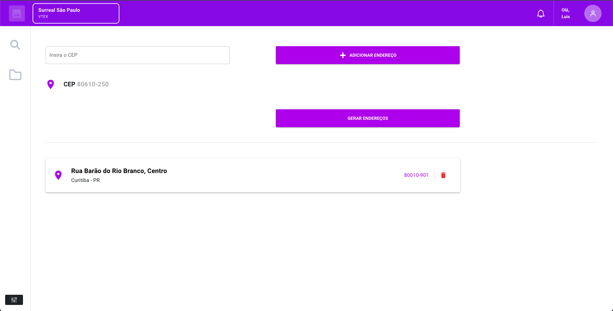

<h1 align="center">
  Via cep
</h1>

<h5 align="center">
  Projeto feito utilizando a API pública ViaCEP
</h5>

## :rocket: Como executar

<ul>
  <li>Clonar o projeto</li>
  <li>Entrar pasta na raiz e executar o comando <strong>yarn</strong></li>
  <li>Executar o projeto com o comando <strong>yarn quasar dev</strong></li>
  <li>O projeto será executado na porta <strong>http://localhost:8080</strong></li>
</ul>

## :speech_balloon: Funcionalidades

<ul>
  <li>Busca por CEPs válidos</li>
  <li>Endereços salvos ficam salvos no locastorage</li>
  <li>Exclusão de endereços buscados</li>
</ul>

## ⌨️ Tecnologias

<ul>
  <li>VueJs</li>
  <li>Quasar</li>
  <li>Axios</li>
</ul>
